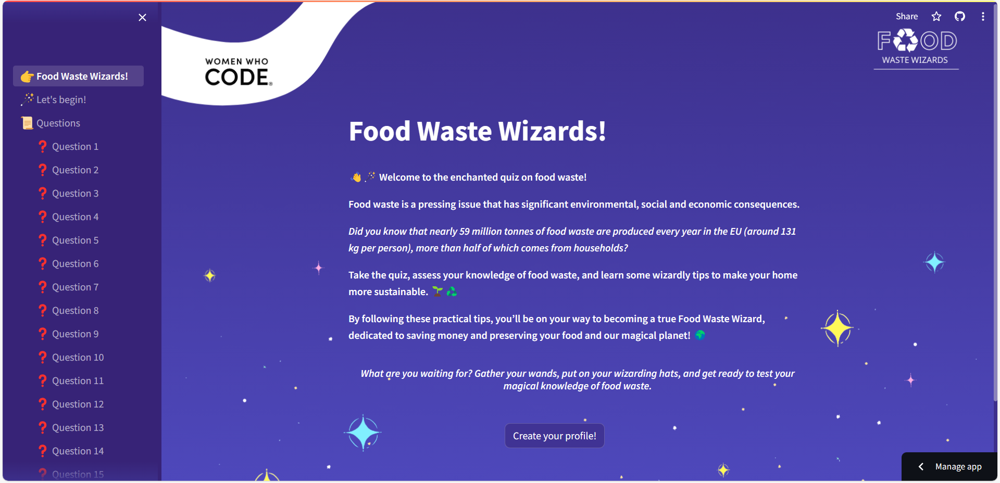

# WWC_SocialGood23 - Food Waste Wizard 🪄🧙

[WWCode Hackathon For Social Good](https://hopin.com/events/wwcode-hackathon-for-social-good/registration) is a global online hackathon (Oct.12th - Nov. 4th, 2023) 🌍. Where you can learn and develop a project for the social good.
Our solution is an Educational Quiz Application - *Food Waste Wizard*. 

## Challenge Statement 📜

Food waste is a pressing issue that has significant environmental, social and economic consequences.  
Our goal is to develop an information-based intervention by creating an interactive and engaging multiple-choice quiz application with 20 questions, using Python as the main code language and the Python-based library Streamlit for web application development.  
The app aims to provide an enjoyable and educational experience for users, testing their knowledge and giving them practical tips on how to make their home more sustainable, encouraging them to take simple measures and contribute to reducing food waste.

You can check our project's presentation [here](https://www.canva.com/design/DAFzaABbGlg/yeA_5gAq0esBqKQFyXQbXA/view?utm_content=DAFzaABbGlg&utm_campaign=designshare&utm_medium=link&utm_source=editor)

## Food Waste Wizard 🌟

Are you ready to explore the realm of food waste and sustainability? Join us as we embark on this mystical journey to reduce food waste.♻️

*Go to Food Waste Wizards Streamlit app and let the quiz begin!* 👇

⚠️ ***User notes***

1. For a better experience, we recommend that you go to settings and change the app theme to custom theme; 

2. Beware: Once the user is on the "Question 1" page, they should start the quiz and not go to the previous pages. This will prevent the chosen avatar from proceeding to the following pages and will display an error message;

3. Use the app on desktop rather than mobile, as some of the features may not look right.

*Thank you!* 

## Food Waste Wizard's Team

🧙‍♀️ [Inês Alves](http://www.linkedin.com/in/inêstavaresalves) - *Team Lead* | Python, Machine Learning 
🧙‍♀️ [Maria Manuela Alves](https://www.linkedin.com/in/maria-manuela-alves/) - *Team Member* | Python, Machine Learning

